```mermaid
graph TD;
    A[Project Root]
    A --> B[README.md]
    A --> C[common]
    A --> D[config]
    A --> E[logs]
    A --> F[mq]
    A --> G[pipe]
    A --> H[protocols]
    A --> I[rest_test.py]
    A --> J[socket_order.py]
    A --> K[socket_ticker.py]
    A --> L[poetry.lock]
    A --> M[pyproject.toml]
    A --> N[requirements.txt]

    C --> C1[client]
    C --> C2[core]
    C --> C3[exception]
    C --> C4[setting]
    C --> C5[utils]

    C1 --> C1A[market_rest]
    C1 --> C1B[market_socket]

    C1A --> C1A1[async_api_client.py]
    C1A --> C1A2[rest_interface.py]

    C1B --> C1B1[async_socket_client.py]
    C1B --> C1B2[websocket_interface.py]

    C2 --> C2A[abstract]
    C2 --> C2B[data_format.py]
    C2 --> C2C[types]

    C2A --> C2A1[__init__.py]
    C2A --> C2A2[abstract_async_request.py]
    C2A --> C2A3[abstract_stream.py]
    C2A --> C2A4[abstract_trade_api.py]

    C2C --> C2C1[__init__.py]
    C2C --> C2C2[_common_exchange.py]

    C3 --> C3A[__init__.py]
    C3 --> C3B[exception.py]

    C4 --> C4A[properties.py]
    C4 --> C4B[socket_parameter.py]
    C4 --> C4C[urls.conf]

    C5 --> C5A[logger.py]
    C5 --> C5B[other_util.py]

    D --> D1[asia]
    D --> D2[korea]
    D --> D3[ne]
    D --> D4[yml_param_load.py]
    D --> D5[types]

    D1 --> D1A[_market_rest.yml]
    D1 --> D1B[_market_socket.yml]

    D2 --> D2A[_market_rest.yml]
    D2 --> D2B[_market_socket.yml]

    D3 --> D3A[_market_rest.yml]
    D3 --> D3B[_market_socket.yml]

    D5 --> D5A[__init__.py]
    D5 --> D5B[_exchange.py]

    F --> F1[data_admin.py]
    F --> F2[data_interaction.py]
    F --> F3[data_partitional.py]
    F --> F4[kafka-docker]

    F4 --> F4A[docker_container_remove.sh]
    F4 --> F4B[fluentd-cluster.yml]
    F4 --> F4C[jmx_exporter]
    F4 --> F4D[kafka-compose.yml]
    F4 --> F4E[kui]
    F4 --> F4F[mq]
    F4 --> F4G[visualization]

    F4C --> F4C1[jmx_prometheus_javaagent-1.0.1.jar]
    F4C --> F4C2[kafka-broker.yml]

    F4E --> F4E1[config.yml]

    F4F --> F4F1[kafka-docker]
    F4F1 --> F4F1A[kui]
    F4F1A --> F4F1A1[config.yml]

    F4G --> F4G1[grafana]
    F4G --> F4G2[prometheus]

    F4G2 --> F4G2A[config]
    F4G2A --> F4G2A1[prometheus.yml]

    G --> G1[connection]
    G1 --> G1A[connection.py]
    G1 --> G1B[socket_init.py]

    H --> H1[client]
    H --> H2[connection]

    H1 --> H1A[asia]
    H1 --> H1B[korea]
    H1 --> H1C[ne]

    H1A --> H1A1[rest_asia_exchange.py]
    H1A --> H1A2[socket_asia_exchange.py]

    H1B --> H1B1[rest_korea_exchange.py]
    H1B --> H1B2[socket_korea_exchange.py]

    H1C --> H1C1[rest_ne_exchange.py]
    H1C --> H1C2[socket_ne_exchange.py]

    H2 --> H2A[coin_rest_api.py]
    H2 --> H2B[coin_socket.py]
```

# Coin Data Stream processing in Kafka


## 프로젝트 개요

이 프로젝트는 Kafka를 활용하여 현재가 정보를 수집하는 시스템입니다.
1. 대한민국 거래소(업비트, 빗썸, 코인원, 코빗)
2. 아시아 거래소(OKX, Bybit, Gateio)
3. 유럽 및 북미 거래소(바이낸스, 크라켄, 코인베이스) 

### 주요 기능

	•	데이터 수집: REST API를 통해 각 거래소의 현재가 정보를 불러오고, 웹소켓을 통해 실시간으로 현재가 데이터를 수집합니다.
	•	데이터 전처리: 수집된 현재가 데이터를 Pydantic을 이용하여 전처리한 후, Kafka를 통해 전달합니다.
	•	비동기 처리:  asyncio를 사용하여 비동기적으로 데이터를 처리하며, 효율적인 데이터 수집과 전송을 구현합니다.
	•	예외 처리: API 호출 실패 및 데이터 형식 오류 등 다양한 예외 상황에 대비하여 적절한 예외 처리를 구현하여 시스템의 안정성을 높입니다.
    
### 목표
	•	이 시스템은 다양한 거래소의 실시간 현재가 데이터를 통합하여, 더 나은 분석 및 거래 결정을 지원하는 것을 목표로 합니다.
 

### 실행 방법 
```python3
poetry shell
# topic_create
python topic_create.py

# rest
python rest_test.py

# socket
python socket_test.py
```


### 시스템 아키텍처 


### 전체 파일 구조 
```
📦 Project Root
├── 📜 README.md                # 📄 프로젝트에 대한 전반적인 설명과 사용 방법을 담은 파일
├── 📂 common                   # 🛠️ 공통으로 사용되는 모듈을 모아놓은 디렉토리
│   ├── 📂 client               # 🌐 API 클라이언트와 거래소 인터페이스 관련 모듈
│   │   ├── 📂 market_rest
│   │   │   ├── 🐍 async_api_client.py          # 비동기 API 호출을 위한 클라이언트 구현
│   │   │   └── 🐍 rest_interface.py            # 거래소 REST 호출 인터페이스를 정의한 모듈
│   │   └── 📂 market_socket
│   │       ├── 🐍 async_socket_client.py       # 비동기 소켓 클라이언트 구현
│   │       └── 🐍 websocket_interface.py       # 거래소 웹소켓 호출 인터페이스를 정의한 모듈
│   ├── 📂 core                 # ⚙️ 핵심 로직 및 추상화된 구조를 포함한 디렉토리
│   │   ├── 📂 abstract         # 📝 추상화된 클래스들을 모아둔 하위 디렉토리
│   │   │   ├── 🐍 __init__.py               # 추상 모듈 초기화 파일
│   │   │   ├── 🐍 abstract_async_request.py # 비동기 요청을 추상화한 클래스
│   │   │   ├── 🐍 abstract_stream.py        # 스트림 처리 추상 클래스
│   │   │   └── 🐍 abstract_trade_api.py     # 거래 API 추상 클래스
│   │   ├── 🐍 data_format.py    # 데이터 포맷 변환 및 처리 모듈
│   │   └── 📂 types            # 🗂️ 공통 데이터 타입 정의 모듈
│   │       ├── 🐍 __init__.py   # 타입 모듈 초기화 파일
│   │       └── 🐍 _common_exchange.py # 거래소 관련 공통 데이터 타입 정의
│   ├── 📂 exception            # ❗ 예외 처리를 위한 모듈
│   │   ├── 🐍 __init__.py       # 예외 처리 모듈 초기화 파일
│   │   └── 🐍 exception.py      # 커스텀 예외 정의
│   ├── 📂 setting              # ⚙️ 설정 파일 관련 모듈
│   │   ├── 🐍 properties.py     # 기본 속성 및 설정 값 관리
│   │   ├── 🐍 socket_parameter.py # 소켓 연결 파라미터 정의
│   │   └── 🐍 urls.conf         # API 엔드포인트 URL 설정
│   └── 📂 utils                # 🧰 공통 유틸리티 함수 모음
│       ├── 🐍 logger.py        # 로그 관리 모듈
│       └── 🐍 other_util.py    # 기타 유틸리티 함수들
├── 📂 config                   # 🗂️ 설정 관련 파일을 모아둔 디렉토리
│   ├── 📂 asia                 # 아시아 거래소 설정
│   │   ├── 🔧 _market_rest.yml   # 아시아 거래소 REST API 설정
│   │   └── 🔧 _market_socket.yml # 아시아 거래소 소켓 설정
│   ├── 📂 korea                # 한국 거래소 설정
│   │   ├── 🔧 _market_rest.yml   # 한국 거래소 REST API 설정
│   │   └── 🔧 _market_socket.yml # 한국 거래소 소켓 설정
│   ├── 📂 ne                   # 북동 아시아 거래소 설정
│   │   ├── 🔧 _market_rest.yml   # 북동 아시아 거래소 REST API 설정
│   │   └── 🔧 _market_socket.yml # 북동 아시아 거래소 소켓 설정
│   ├── 🐍 yml_param_load.py   # yml 파라미터 로드 모듈
│   └── 📂 types                # 설정 관련 데이터 타입 정의
│       ├── 🐍 __init__.py       # 타입 모듈 초기화 파일
│       └── 🐍 _exchange.py      # 거래소 타입 정의
├── 📂 logs                     # 📝 로그 파일 디렉토리
├── 📂 mq                       # 📊 메시지 큐 관련 모듈
│   ├── 🐍 data_admin.py         # 데이터 관리 모듈
│   ├── 🐍 data_interaction.py   # 데이터 상호작용 모듈
│   ├── 🐍 data_partitional.py   # 데이터 분할 처리 모듈
|   ├── 📂 kafka-docker             # 🐳 Kafka 관련 Docker 설정 파일
│   	├── 📜 docker_container_remove.sh  # Docker 컨테이너 삭제 스크립트
│   	├── 🐳 fluentd-cluster.yml        # Fluentd 클러스터 설정 파일
│   	├── 📂 jmx_exporter            # JMX Exporter 관련 설정
│   	│   ├── ☕ jmx_prometheus_javaagent-1.0.1.jar # JMX Exporter JAR 파일
│   	│   └── 📜 kafka-broker.yml      # Kafka 브로커 설정 파일
│   	├── 🐳 kafka-compose.yml        # Kafka 컴포즈 설정 파일
│   	├── 📂 kui                     # KUI 관련 설정
│   	│   └── 📜 config.yml          # KUI 설정 파일
│   	├── 📂 mq                      # Kafka Docker 구성 관련 디렉토리
│   	│   └── 📂 kafka-docker        # Kafka Docker 관련 추가 설정
│   	│       └── 📂 kui             # KUI 관련 추가 설정
│   	│           └── 📜 config.yml  # KUI 추가 설정 파일
│   	└── 📂 visualization           # 데이터 시각화 관련 파일
│   	    ├── 📂 grafana            # Grafana 설정 파일
│   	    └── 📂 prometheus         # Prometheus 관련 설정
│   	        └── 📂 config          # Prometheus 설정 디렉토리
│   	            └── 📜 prometheus.yml  # Prometheus 설정 파일
├── 📂 pipe                     # 📡 데이터 전송 및 처리 관련 모듈을 포함한 디렉토리
│   ├── 📂 connection           # 연결 관련 모듈
│   │   ├── 🐍 connection.py       # 연결을 위한 클라이언트 구현
│   │   └── 🐍 socket_init.py      # 소켓 초기화 모듈
├── 🔧 poetry.lock               # Poetry 패키지 종속성 관리 파일
├── 🔧 pyproject.toml            # 프로젝트 메타데이터와 설정 파일
├── 🔧 requirements.txt          # 📝 Python 패키지 종속성 목록
├── 🐍 rest_test.py              # REST API 테스트 스크립트
├── 🐍 socket_order.py           # 주문 관련 소켓 모듈
└── 🐍 socket_ticker.py          # 현재가 관련 소켓 모듈
```


