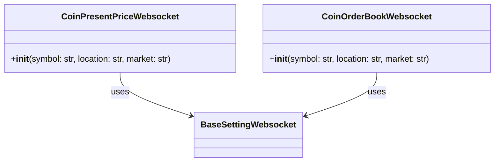

## pipe folder 의 역할 

📂 pipe

📡 데이터 전송 및 처리 관련 모듈을 포함한 디렉토리
이 디렉토리는 다양한 거래소와의 통신을 위한 클라이언트를 포함하여, 소켓과 REST API를 통한 데이터 전송 및 처리를 담당합니다.

### 프로세스 구조 


### pipe file 구조 
```
### 📂 pipe                     # 📡 데이터 전송 및 처리 관련 모듈을 포함한 디렉토리
├── 🐍 connection.py            # 데이터 소스와의 연결(실행)을 관리하는 모듈
└── 🐍 socket_init.py           # 소켓 초기화 및 실행 출발점 을 담당하는 모듈
```

