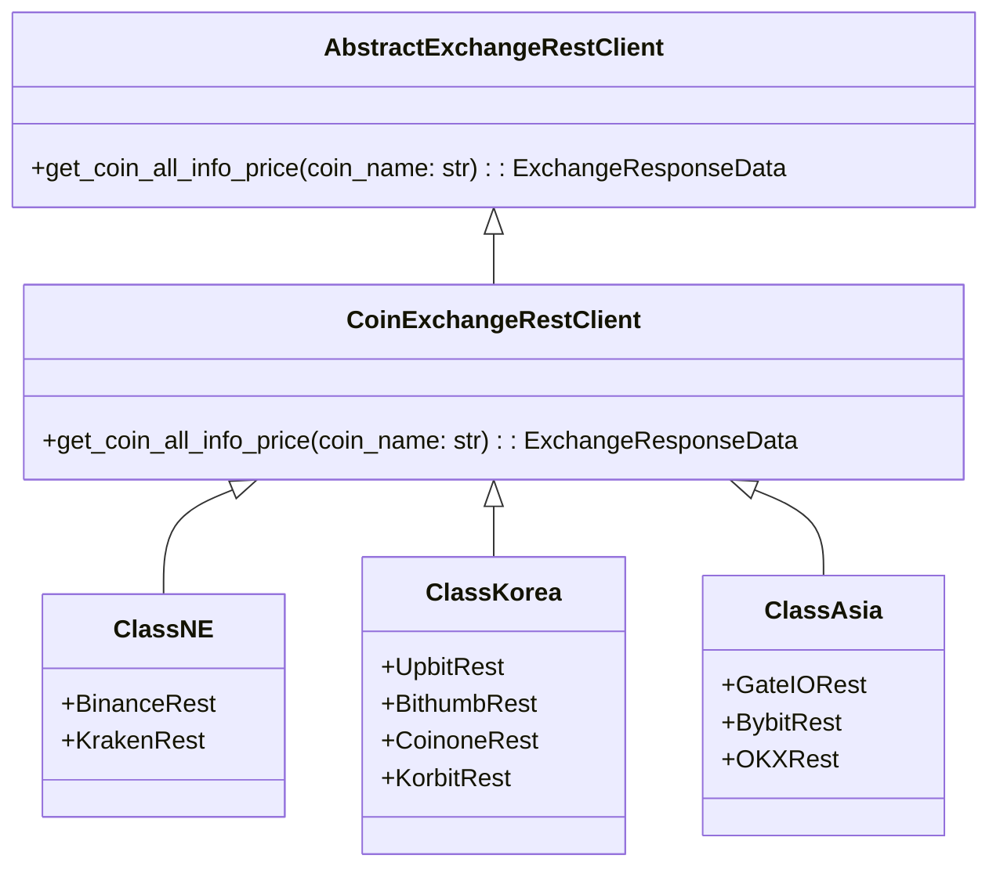
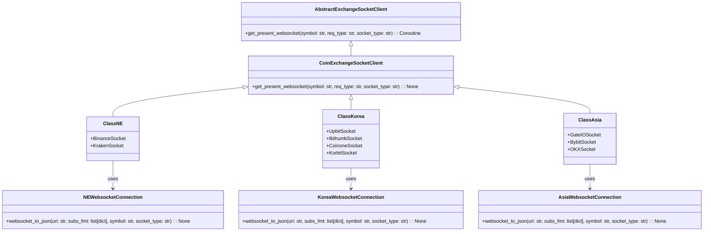
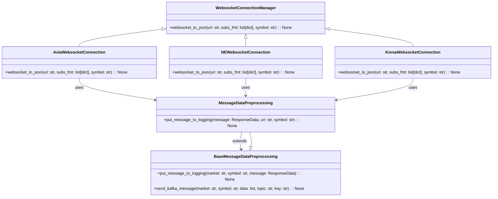
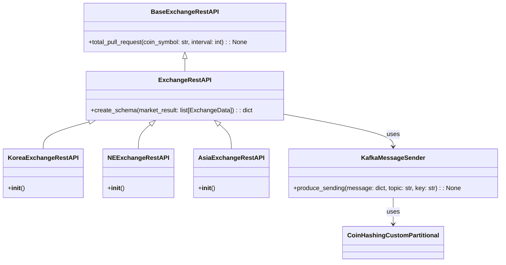

### 클라이언트 모듈 설명

각 거래소의 REST API 와 WebSocket 요청을 처리하기 위한 클라이언트 클래스들이 포함되어 있습니다.

### 📂 protocols               # 🌐 거래소와의 통신을 위한 클라이언트 모듈
```
├── 📂 client                  # 💻 각 지역별 거래소 클라이언트 모듈
│   ├── 📂 asia                # 🌏 아시아 거래소 클라이언트
│   │   ├── 🐍 rest_asia_exchange.py     # 아시아 거래소 REST API 처리 모듈
│   │   └── 🐍 socket_asia_exchange.py   # 아시아 거래소 소켓 API 처리 모듈
│   ├── 📂 korea               # 🇰🇷 한국 거래소 클라이언트
│   │   ├── 🐍 rest_korea_exchange.py    # 한국 거래소 REST API 처리 모듈
│   │   └── 🐍 socket_korea_exchange.py  # 한국 거래소 소켓 API 처리 모듈
│   └── 📂 ne                  # 🌍 해외 거래소 클라이언트
│       ├── 🐍 rest_ne_exchange.py        # 해외 거래소 REST API 처리 모듈
│       └── 🐍 socket_ne_exchange.py      # 해외 거래소 소켓 API 처리 모듈
├── 📂 connection              # 🔗 API 연결 관련 모듈
│   ├── 🐍 coin_rest_api.py    # 코인 REST API 연결 모듈
│   └── 🐍 coin_socket.py       # 코인 소켓 연결 모듈
└── 📜 readme.md              # protocols 디렉토리에 대한 설명을 담고 있는 파일
```

### REST API 프로세스 구조 


### WebSocket 프로세스 구조


--------------------------------

### Websocket Connection Manager 프로세스 구조


### REST Connection Manager 프로세스 구조


