### 클라이언트 모듈 설명

각 거래소의 REST API 요청을 처리하기 위한 클라이언트 클래스들이 포함되어 있습니다.

### 프로세스 구조 

```mermaid
classDiagram
    class AbstractExchangeRestClient {
        +get_coin_all_info_price(coin_name: str): ExchangeResponseData
    }
    class AbstractExchangeSocketClient {
        +get_present_websocket(symbol: str, req_type: str): Coroutine
    }
    class CoinExchangeRestClient {
        +get_coin_all_info_price(coin_name: str): ExchangeResponseData
    }
    class CoinExchangeSocketClient {
        +get_present_websocket(symbol: str, req_type: str): None
    }
    class BinanceRest {
        +get_coin_all_info_price(coin_name: str): ExchangeResponseData
    }
    class KrakenRest {
        +get_coin_all_info_price(coin_name: str): ExchangeResponseData
    }
    class UpbitRest {
        +get_coin_all_info_price(coin_name: str): ExchangeResponseData
    }
    class BithumbRest {
        +get_coin_all_info_price(coin_name: str): ExchangeResponseData
    }
    class BinanceSocket {
        +price_present_websocket(symbol: str): None
        +orderbook_present_websocket(symbol: str): None
    }
    class UpbitSocket {
        +price_present_websocket(symbol: str): None
        +orderbook_present_websocket(symbol: str): None
    }

    AbstractExchangeRestClient <|-- CoinExchangeRestClient
    AbstractExchangeSocketClient <|-- CoinExchangeSocketClient
    CoinExchangeRestClient <|-- BinanceRest
    CoinExchangeRestClient <|-- KrakenRest
    CoinExchangeRestClient <|-- UpbitRest
    CoinExchangeRestClient <|-- BithumbRest
    CoinExchangeSocketClient <|-- BinanceSocket
    CoinExchangeSocketClient <|-- UpbitSocket
    CoinExchangeSocketClient --> BaseMessageDataPreprocessing : uses
``` 


### 📂 protocols               # 🌐 거래소와의 통신을 위한 클라이언트 모듈
```
├── 📂 client                  # 💻 각 지역별 거래소 클라이언트 모듈
│   ├── 📂 asia                # 🌏 아시아 거래소 클라이언트
│   │   ├── 🐍 rest_asia_exchange.py     # 아시아 거래소 REST API 처리 모듈
│   │   └── 🐍 socket_asia_exchange.py   # 아시아 거래소 소켓 API 처리 모듈
│   ├── 📂 korea               # 🇰🇷 한국 거래소 클라이언트
│   │   ├── 🐍 rest_korea_exchange.py    # 한국 거래소 REST API 처리 모듈
│   │   └── 🐍 socket_korea_exchange.py  # 한국 거래소 소켓 API 처리 모듈
│   └── 📂 ne                  # 🌍 해외 거래소 클라이언트
│       ├── 🐍 rest_ne_exchange.py        # 해외 거래소 REST API 처리 모듈
│       └── 🐍 socket_ne_exchange.py      # 해외 거래소 소켓 API 처리 모듈
├── 📂 connection              # 🔗 API 연결 관련 모듈
│   ├── 🐍 coin_rest_api.py    # 코인 REST API 연결 모듈
│   └── 🐍 coin_socket.py       # 코인 소켓 연결 모듈
└── 📜 readme.md              # protocols 디렉토리에 대한 설명을 담고 있는 파일
```